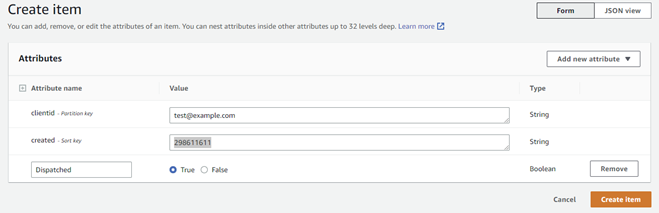

In this project we will create a DynamoDB table and import data using command line API. Then we will create a global table so that we can replicate our database to another aws region.

---
## **STEPS**
### Step 1 : Creating DynamoDB table 
> Go to aws DynamoDB and click on Create table with following configuration :
- Table name = `mystore`
- Partition key = `clientid`
- Sort key = `created`
- For settings , choose `customize settings`
- For read/write capacity settings, choose `On-demand`
- Leave everything else as default and create table 
### Step 2: Adding Items in the table 
- Go to your command line and go to the file location where you have saved mystore.json file
- Type the following command 
`aws dynamodb batch-write-item --request-items file://mystore.json`
- From the left side menu go to `Explore items` and click on `mystore table` . We will see we have a list of items.
> We have another way to see the items in command line 
>Just type 
`aws dynamodb scan --table-name mystore`
> this will show the list of items in the command line 
### Step 3 : Creating global table 
 - Select the table and click on `global table`
- Then from the top menu click on `create replica`
- Available replication Regions : `US west (N.California)`
> Once the replica creation is completed we can then open US West region in another tab and see that the table is duplicated in N.California.
If we select the table we can see all the information about the table including its own unique ARN
> Now we will add an item in the table in N.California 
- Click on `items` and then choose the table . Select `create item`
- Clientid : `test@example.com`
- Created : `298611611`

- From top right corner choose `add new attribute `
- Choose `boolian` 
- Type dispatched and set true and then `create item` 
> Now if we go to the table in N.virginia region we will see that this item is replicated back there.

> If you want to delete the table Project, first delete the one in the N.california(Replica) and then in N.virginia(Source)
